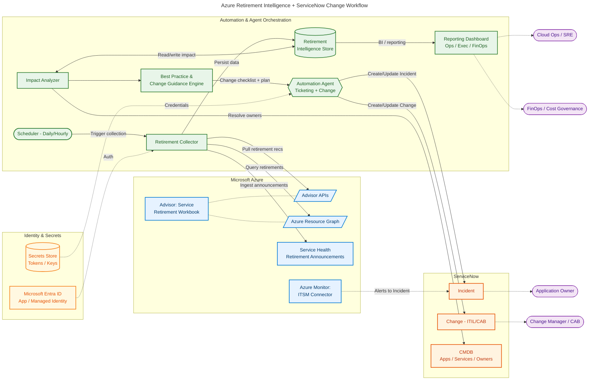

# Azure Retirement Management Intelligence

Programmatically detect upcoming Azure service/feature retirements across subscriptions, assess impact to resources, generate change recommendations and best practices, and automate incident/change workflows in ServiceNow.

## Architecture

## Components

### Azure Signal Sources

| Component | Description |
|-----------|-------------|
| **Advisor: Service Retirement Workbook** | Centralized view of service retirements and impacted resources |
| **Azure Advisor APIs** | Automation pull for retirement recommendations |
| **Azure Resource Graph** | Alternative query path for retirements data |
| **Azure Service Health** | Portal notifications and retirement announcements |
| **ITSM Connector** | Azure Monitor integration with ServiceNow (note: ITSM actions path deprecated since Sept 2022) |

### Automation & Agent Orchestration

| Component | Responsibilities |
|-----------|-----------------|
| **Scheduler** | Triggers discovery and correlation runs (daily/hourly) |
| **Retirement Collector** | Query retirements across subscriptions, normalize/deduplicate events, store results |
| **Impact Analyzer** | Map retirements to resources/apps/owners, determine urgency by retirement date + blast radius, enrich with migration guidance |
| **Best Practice & Change Guidance Engine** | Generate change plan checklists (risk, testing, rollback, comms), suggest governance actions, produce remediation runbook outlines |
| **Automation Agent** | Decide Incident vs Change vs Problem, create/update ServiceNow tickets, attach impact analysis and recommendations, track status and re-notify on approaching deadlines |
| **Retirement Intelligence Store** | Persistence for retirements, impacted resources, ownership mappings, ticket links, and change plans |
| **Reporting Dashboard** | Top upcoming retirements, subscriptions at risk, trend + completion rate, cost/risk posture views |

### ServiceNow

| Module | Purpose |
|--------|---------|
| **Incident** | Break/fix urgency tickets |
| **Change (ITIL/CAB)** | Standard change requests with CAB workflow |
| **CMDB** | Application, service, and owner resolution |

### Identity & Secrets

| Component | Responsibilities |
|-----------|-----------------|
| **Microsoft Entra ID** | Auth for Azure APIs, least privilege across subscriptions |
| **Secrets Store** | Store ServiceNow credentials/tokens, rotate secrets |

## Personas

| Persona | Role |
|---------|------|
| **Cloud Ops / SRE** | Consumes dashboards and acts on retirement remediation |
| **Change Manager / CAB** | Reviews and approves change requests |
| **Application Owner** | Receives incident notifications for affected applications |
| **FinOps / Cost Governance** | Monitors cost and risk posture from retirements |

## Security Principles

- Least privilege across subscriptions via Entra ID app or managed identity
- No long-lived secrets in code; store tokens in secrets vault
- Audit trail: ticket IDs + change approvals linked back to retirement IDs

### Security Controls

| Control | Description |
|---------|-------------|
| **RBAC** | Scoped at Management Group / Subscription level |
| **Secret Rotation** | OAuth token management for ServiceNow |
| **Observability** | Logging + alerting for failed ticket creation / workflow execution |

## Outputs

- Ranked list of upcoming retirements by date + impacted resources
- ServiceNow Incident/Change records with impact + recommended actions
- Executive dashboard view of risk posture and remediation progress
